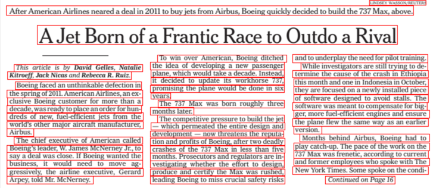

# 01 Surya OCR工具包
Surya 是一个多语言文档 OCR 工具包。它可以做到：（准确的行级文本检测、文本识别、表格和图表检测）</br>
pip install surya-ocr，模型权重将在您第一次运行 surya 时自动下载。</br>
https://github.com/VikParuchuri/surya</br>



# 02 DB-GPT-Hub:利用LLMs实现Text-to-SQL
DB-GPT-Hub是一个利用LLMs实现Text-to-SQL解析的实验项目，主要包含数据集收集、数据预处理、模型选择与构建和微调权重等步骤，通过这一系列的处理可以在提高Text-to-SQL能力的同时降低模型训练成本，让更多的开发者参与到Text-to-SQL的准确度提升工作当中，最终实现基于数据库的自动问答能力，让用户可以通过自然语言描述完成复杂数据库的查询操作等工作。

该项目提供数据集、支持多种base模型微调、支持lora和QLora，支持多卡训练，提供不同模型微调的lora_target且包含模型效果评估。</br>
https://github.com/eosphoros-ai/DB-GPT-Hub</br>


# 03 MarkDownload - Markdown Web Clipper
Chrome插件，用于将网页信息转换为md文件下载</br>
https://chromewebstore.google.com/detail/markdownload-markdown-web/pcmpcfapbekmbjjkdalcgopdkipoggdi</br>

# 04 新手LLM培训指南 --- The Novice's LLM Training Guide.md
[原始版本链接](https://rentry.org/llm-training#the-basics)https://rentry.org/llm-training#the-basics</br>
[双语翻译版本,新手LLM培训指南 --- The Novice's LLM Training Guide](./新手LLM培训指南%20---%20The%20Novice's%20LLM%20Training%20Guide.md)</br>


# 05 Infinity 
Infinity 是一个高吞吐量、低延迟的 REST API，用于提供向量嵌入，支持各种句子转换器模型和框架。</br>
pip install infinity-emb[all]</br>
```python
import asyncio
from infinity_emb import AsyncEmbeddingEngine

sentences = ["Embed this is sentence via Infinity.", "Paris is in France."]
engine = AsyncEmbeddingEngine(model_name_or_path = "BAAI/bge-small-en-v1.5", engine="torch")

async def main(): 
    async with engine: # engine starts with engine.astart()
        embeddings, usage = await engine.embed(sentences=sentences)
    # engine stops with engine.astop()
asyncio.run(main())
```

https://github.com/michaelfeil/infinityhttps://github.com/michaelfeil/infinity</br>

# 06 Frontend-only live semantic search with transformers.js
直接在浏览器中进行语义搜索！使用 transformers.js 和 sentence-transformers/all-MiniLM-L6-v2 的量化版本，在没有服务器端推理的情况下计算嵌入和余弦相似度。</br>
数据隐私友好 - 您输入的文本数据不会发送到服务器，而是保留在您的浏览器中！</br>
https://github.com/do-me/SemanticFinder</br>


# 07 bce-reranker-base_v1 + bce-embedding-base_v1
BCEmbedding是由网易有道开发的双语和跨语种语义表征算法模型库，其中包含EmbeddingModel和RerankerModel两类基础模型。EmbeddingModel专门用于生成语义向量，在语义搜索和问答中起着关键作用，而RerankerModel擅长优化语义搜索结果和语义相关顺序精排。</br>

bce-embedding-base_v1 主要特点(Key Features)：
中英双语，以及中英跨语种能力(Bilingual and Crosslingual capability in English and Chinese)；
RAG优化，适配更多真实业务场景(RAG adaptation for more domains)；
方便集成进langchain和llamaindex(Easy integrations for langchain and llamaindex)。</br>

bce-reranker-base_v1 主要特点(Key Features)：
中英日韩四个语种，以及中英日韩四个语种的跨语种能力(Multilingual and Crosslingual capability in English, Chinese, Japanese and Korean)；
RAG优化，适配更多真实业务场景(RAG adaptation for more domains)；
适配长文本做rerank(Fix the reranking strategy for long passages)。</br>
https://huggingface.co/maidalun1020/bce-reranker-base_v1</br>
https://huggingface.co/maidalun1020/bce-embedding-base_v1</br>

# 08 中文 Emebedding & Reranker 模型选型
[中文 Emebedding & Reranker 模型选型](./中文%20Emebedding%20&%20Reranker%20模型选型.md)

# 09 Transform Screenshots into HTML Code
UI界面截图转换成HTML代码。
包含 823,000 对网站屏幕截图和 HTML/CSS 代码的数据集。 
Websight 旨在训练视觉语言模型 （VLM） 以将图像转换为代码。</br>
数据集：https://huggingface.co/datasets/HuggingFaceM4/WebSight</br>
模型：  https://huggingface.co/HuggingFaceM4/VLM_WebSight_finetuned</br>

# 10 音频降噪增强模型
Resemble Enhance 是一种 AI 驱动的工具，旨在通过执行降噪和增强来提高整体语音质量。它由两个模块组成：一个降噪器，用于将语音与嘈杂的音频分离，以及一个增强器，通过恢复音频失真和扩展音频带宽来进一步提高感知音频质量。这两个模型在高质量的 44.1kHz 语音数据上进行训练，可保证以高质量增强您的语音。

安装稳定版本：
 ```
pip install resemble-enhance --upgrade</br>
 ```
增强：
 ```
resemble_enhance in_dir out_dir</br>
 ```
降噪：
 ```
resemble_enhance in_dir out_dir --denoise_only</br>
 ```