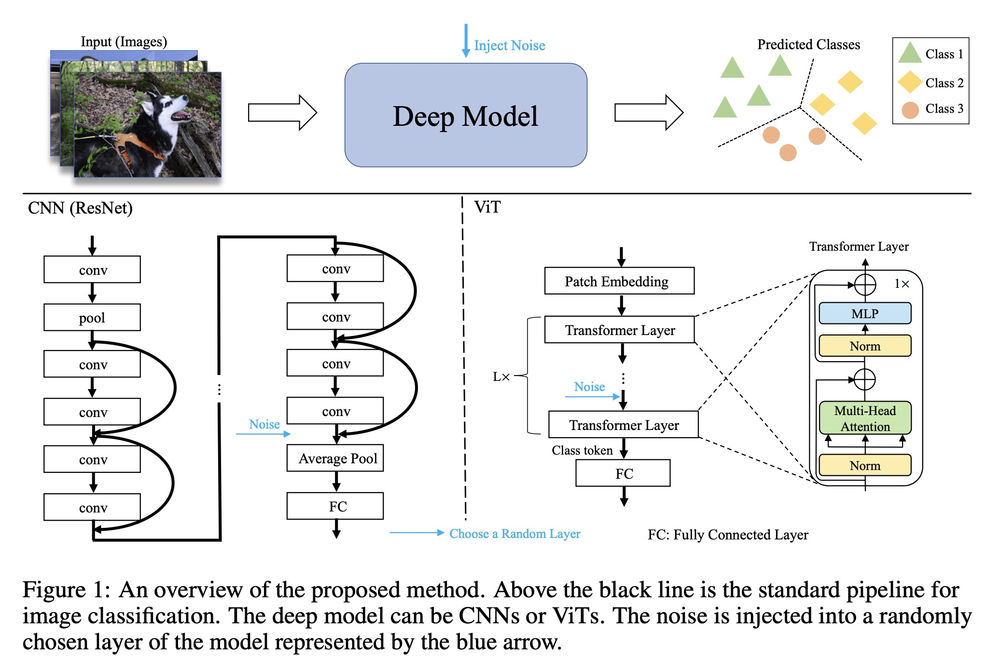

# 01 NoisyNN
探索信息熵变化对学习系统的影响
- 噪声通常被认为对机器学习模型有害。然而，这项工作表明，通过降低信息熵和任务复杂性，特定的噪声是有益的。

- 噪声根据是否降低任务熵分为正噪声（PN）和有害噪声（HN）。PN 降低了复杂性，而 HN 增加了复杂性。

- 探讨了三种噪声类型：高斯噪声、线性变换噪声和胡椒盐噪声。高斯和盐和胡椒在理论上被证明是HN。在一定的约束条件下，线性变换可以是 PN。

- 大量实验表明，PN 提高了 CNN 和 ViT 在 ImageNet 上的性能。通过将PN注入ViT，新的SOTA ImageNet准确率达到95%以上。

- PN 还可以提高其他任务的性能，例如域适配。PN 赋能的 ViT 超越了 Office-Home 和 VisDA2017 基准测试的现有方法。 

- 分析表明，PN 的有效性随着数据集大小的增加而增长。数据集越大，熵缩减就越高。推导最优PN矩阵以最大化熵变。

- 这种利用 PN 的框架和理论可以推广到模型和任务中。PN在CV以外的其他领域具有巨大潜力。 

https://arxiv.org/abs/2309.10625 

# 拼音与汉字之间的相互转换
pinyin-plus：简繁体汉字转拼音的项目，解决多音字的问题。ElasticSearch、solr 的拼音分词工具 
汉字转拼音的库，有如下特点： 
- 拼音数据基于 cc-cedict 、kaifangcidian 开源词库
- 基于拼音词库的数据初始化分词引擎进行分词，准确度高，解决多音字的问题
- 支持繁体字
- 支持自定义词库，词库格式同 cc-cedict 字典格式
- api 简单，分为普通模式、索引模式